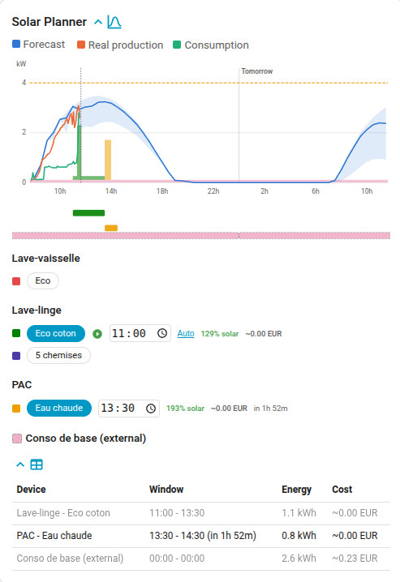

# Solar Planner Scheduler

Home Assistant integration that schedules devices around your solar forecast and shows them on a
bundled Lovelace card. Example: tell it your washing machine takes 2h, and it picks the best
2h window today to run it on solar surplus (or, with tariff tracking on, whichever window is
cheapest, solar or off-peak grid).



## Requirements

A solar forecast entity already set up in Home Assistant (e.g.
[Solcast](https://github.com/BJReplay/ha-solcast-solar)).

## Installation

Via HACS (custom repository, not yet in the default store):

1. HACS -> the three-dot menu (top right) -> Custom repositories.
2. URL: `https://github.com/Rom1-B/solar-planner-scheduler`, category: Integration.
3. Install "Solar Planner Scheduler", restart Home Assistant.
4. Settings -> Devices & services -> Add integration -> Solar Planner Scheduler.

Or manually: copy `custom_components/solar_planner_scheduler/` into your HA
`config/custom_components/`, restart, then add the integration the same way.

## Configuration

Initial setup asks for the shared entities (forecast, forecast tomorrow, production, consumption,
max simultaneous power). Devices, programs and fixed loads are managed via "Configure":

- **Device**: name + optional power sensor. "Manage a device" then opens a menu scoped to that one
  device (edit its power sensor, add/edit/remove its programs).
- **Program**: from a device's own menu, name it, then list its phases, i.e. its power draw over
  time, one line per step (e.g. a washing machine: `20min@150W` to heat, then `1.5h@800W` to spin),
  and optionally check which days it should auto-repeat on. A device can have several programs
  active at once; `switch.<device>_<program>_active` turns each one on or off.
- **Fixed load**: something that also draws power but that this integration can't move or
  control (a pool pump, a fridge cycle), so it's just subtracted from available solar capacity
  when scheduling everything else.
- **Tariffs** (optional): enable tariff tracking, set a monthly subscription price and price bands
  (`HH:MM@price`, one per line, e.g. `22:00@0.1589`). Slot selection always minimizes estimated
  cost, falling back to solar coverage when tracking is off; the real price only shows once enabled.

Turning a program on searches for today's best slot immediately, extending up to 6h past midnight
to reach an overnight tariff band. Once it has run, it repeats on a later day only if that day is
checked in its auto-schedule days. Programs with no auto-schedule days stay off until you turn them
on; programs with auto-schedule days turn on by default.

`datetime.<device>_<program>_start` shows the next start time. Drag its bar on the card, or edit
the entity directly, to force a time. Click "Auto" to cancel a forced time and search again.

## Entities

Per (device, program) pair: `datetime.<device>_<program>_start`,
`binary_sensor.<device>_<program>_should_run`, `switch.<device>_<program>_active`.

`sensor.solar_planner_scheduler_current_price` exposes the live €/kWh price (when tariff tracking
is enabled), usable as the Energy dashboard's "current price" source for grid-consumption cost.

The integration never turns a device on/off itself. Two examples:

1. A device HA controls directly: start it when `should_run` turns on.

```yaml
automation:
  - alias: "Water heater - force heat"
    trigger:
      - platform: state
        entity_id: binary_sensor.water_heater_should_run
        to: "on"
    action:
      - service: switch.turn_on
        target: { entity_id: switch.water_heater_boost }
```

2. A device you start by hand (not controlled by HA): notify 15 minutes before, so there's time to
   load the washing machine and press its own start button.

```yaml
automation:
  - alias: "Washing machine - notify 15 min before start"
    trigger:
      - platform: template
        value_template: >
          
          
          {{ 0 <= remaining_s < 900 }}
    action:
      - service: notify.mobile_app_my_phone
        data:
          message: >
            
            
            Washing machine starts at {{ start_ts | timestamp_custom('%H:%M') }} (in {{ eta_min }} min)
```

Change `900` (15 minutes, in seconds) to whatever lead time you want.

## The bundled card

Served and registered automatically, no separate install.

```yaml
type: custom:solar-planner-card
devices:
  - lave_linge
  - lave_vaisselle
chart_expanded: true    # optional, default true (the forecast chart/gantt/device rows)
table_expanded: false   # optional, default false (the summary table)
table_show_energy: true # optional, default true (the table's Energy column)
table_show_cost: true   # optional, default true (the table's Cost column)
chart_hours_past: 6     # optional, default 6 (hours shown before now)
chart_hours_future: 24  # optional, default 24 (hours shown after now)
```

Each section has its own toggle icon in the card itself; `chart_expanded`/`table_expanded`
only set which state it starts in. The table's Window column shows a countdown to a future start
(e.g. `08:30 - 10:00 (in 2h15m)`). `chart_hours_past`/`chart_hours_future` control the chart/gantt's
fixed display window around the current time; they're display-only and don't affect scheduling.

## Development

```bash
python3 -m venv .venv && .venv/bin/pip install -r requirements-dev.txt
.venv/bin/pytest tests/      # Python
cd frontend && node --test   # JS
```

CI runs both suites plus `hassfest` and HACS validation. `./scripts/check-ci.sh` reproduces them
locally.

## Releasing

Bump `version` in `custom_components/solar_planner_scheduler/manifest.json` and push to `main`.
CI tags that version and creates a matching GitHub release.

## Local testing

```bash
docker compose up -d
```

Open `http://localhost:8123`, finish onboarding, and add the integration. After each code change:
`docker compose restart`, then reload the page.
